# BÁO CÁO ĐỒ ÁN

# XÂY DỰNG DATA WAREHOUSE VÀ KHAI PHÁ DỮ LIỆU THƯƠNG MẠI ĐIỆN TỬ TRÊN BỘ DỮ LIỆU OLIST BRAZILIAN E-COMMERCE

## Thông tin nhóm

- Môn học: Khai phá dữ liệu
- Giảng viên hướng dẫn: ........................................................
- Nhóm thực hiện: ........................................................
- Lớp: ........................................................
- Học kỳ/Năm học: ........................................................

| STT | Họ và tên | MSSV | Vai trò |
|---:|---|---|---|
| 1 | Trần Viết Gia Huy | 31231027056 | Setup, EDA, preprocessing, DWH, ETL |
| 2 | Nguyễn Minh Nhựt | 31231022656 | Iceberg Cube, baseline model, báo cáo/slide |
| 3 | Nguyễn Trọng Hưởng | 31231023691 | Tối ưu mô hình, API |
| 4 | Tô Xuân Đông | 31231025345 | Web app/dashboard |

---

# TÓM TẮT

Đồ án này xây dựng một hệ thống phân tích dữ liệu thương mại điện tử dựa trên bộ dữ liệu Brazilian E-Commerce Public Dataset by Olist. Bộ dữ liệu bao gồm thông tin về đơn hàng, khách hàng, người bán, sản phẩm, thanh toán, vận chuyển, review và vị trí địa lý trong giai đoạn 2016-2018 tại Brazil. Mục tiêu của đồ án là mô tả và phân tích dữ liệu, thực hiện tiền xử lý, xây dựng data warehouse, tính toán Iceberg Cube, huấn luyện mô hình phân loại dự đoán review xấu và triển khai ứng dụng hỗ trợ trực quan hóa/dự đoán.

Hệ thống được xây dựng bằng Python, pandas, scikit-learn, PostgreSQL/SQL Server, FastAPI và Streamlit. Phần data warehouse được thiết kế theo mô hình star schema với fact table `fact_order_items` và các dimension table như `dim_date`, `dim_customer`, `dim_seller`, `dim_product`, `dim_payment`, `dim_order_status`. Cơ chế Iceberg Cube được sử dụng để giữ lại các tổ hợp dữ liệu có ý nghĩa theo các ngưỡng như số lượng đơn hàng, doanh thu và tỷ lệ review xấu. Bài toán classification được phát biểu là dự đoán đơn hàng có review xấu hay không dựa trên thông tin đơn hàng, thanh toán, sản phẩm, khách hàng, seller và giao hàng.

Kết quả thực nghiệm cho thấy pipeline có thể xử lý dữ liệu, load warehouse vào database, sinh kết quả Iceberg Cube và huấn luyện mô hình dự đoán review xấu. Ứng dụng Streamlit và FastAPI giúp người dùng xem dashboard, phân tích cube và thử dự đoán nguy cơ review xấu cho một đơn hàng mới.

Từ khóa: Olist, thương mại điện tử, data warehouse, star schema, Iceberg Cube, classification, bad review prediction, Streamlit, FastAPI.

---

# MỤC LỤC

1. Giới thiệu đề tài
2. Cơ sở lý thuyết và công nghệ sử dụng
3. Mô tả bộ dữ liệu và phân tích khám phá
4. Tiền xử lý dữ liệu và xây dựng đặc trưng
5. Xây dựng Data Warehouse
6. Tính toán Iceberg Cube
7. Mô hình classification dự đoán review xấu
8. Triển khai ứng dụng
9. Kết luận và hướng phát triển
10. Tài liệu tham khảo
11. Phụ lục

---

# CHƯƠNG 1. GIỚI THIỆU ĐỀ TÀI

## 1.1. Lý do chọn đề tài

Trong bối cảnh thương mại điện tử phát triển mạnh, các nền tảng bán hàng trực tuyến tạo ra lượng lớn dữ liệu từ nhiều hoạt động khác nhau như đặt hàng, thanh toán, giao hàng, đánh giá sản phẩm và hành vi của khách hàng. Việc phân tích các dữ liệu này giúp doanh nghiệp hiểu rõ hơn về doanh thu, hiệu quả vận hành, chất lượng giao hàng và mức độ hài lòng của khách hàng.

Bộ dữ liệu Olist Brazilian E-Commerce là một bộ dữ liệu phù hợp cho bài toán khai phá dữ liệu vì có cấu trúc đa bảng, phản ánh nhiều khía cạnh của một hệ thống thương mại điện tử thực tế. Dữ liệu bao gồm khoảng 100 nghìn đơn hàng, thông tin khách hàng, người bán, sản phẩm, thanh toán, review và geolocation. Do đó, bộ dữ liệu này phù hợp để thực hiện đầy đủ các yêu cầu của đồ án: EDA, tiền xử lý, xây dựng data warehouse, tính toán Iceberg Cube, áp dụng classification và triển khai ứng dụng web.

## 1.2. Mục tiêu nghiên cứu

Đồ án hướng đến các mục tiêu chính sau:

- Mô tả đầy đủ bộ dữ liệu Olist và quan hệ giữa các bảng.
- Thực hiện phân tích khám phá dữ liệu để rút ra các insight kinh doanh.
- Tiền xử lý dữ liệu và tạo các đặc trưng phục vụ phân tích/modeling.
- Xây dựng data warehouse theo mô hình star schema bằng PostgreSQL hoặc SQL Server.
- Tính toán Iceberg Cube để phát hiện các nhóm dữ liệu có ý nghĩa.
- Huấn luyện mô hình classification dự đoán đơn hàng có khả năng nhận review xấu.
- Triển khai API và web dashboard để demo kết quả.

## 1.3. Đối tượng và phạm vi nghiên cứu

Đối tượng nghiên cứu là dữ liệu giao dịch thương mại điện tử của Olist, bao gồm đơn hàng, sản phẩm, khách hàng, người bán, thanh toán, giao hàng và đánh giá. Phạm vi nghiên cứu tập trung vào dữ liệu từ năm 2016 đến năm 2018.

Trong phạm vi đồ án này, nhóm tập trung vào phân tích dữ liệu có cấu trúc và bài toán classification dựa trên `review_score`. Phân tích văn bản review bằng NLP chưa được triển khai sâu và được xem là hướng phát triển trong tương lai.

## 1.4. Đóng góp của đề tài

Đồ án có các đóng góp chính:

- Xây dựng pipeline xử lý dữ liệu Olist từ dữ liệu thô đến dữ liệu đã xử lý.
- Thiết kế star schema và load dữ liệu vào PostgreSQL/SQL Server.
- Cài đặt cơ chế Iceberg Cube phục vụ phân tích OLAP.
- Xây dựng mô hình dự đoán review xấu của đơn hàng.
- Triển khai FastAPI và Streamlit dashboard để trình diễn kết quả.

## 1.5. Cấu trúc báo cáo

Báo cáo gồm 9 chương. Chương 1 giới thiệu đề tài. Chương 2 trình bày cơ sở lý thuyết và công nghệ. Chương 3 mô tả dataset và EDA. Chương 4 trình bày tiền xử lý và feature engineering. Chương 5 trình bày data warehouse. Chương 6 trình bày Iceberg Cube. Chương 7 trình bày mô hình classification. Chương 8 trình bày ứng dụng. Chương 9 kết luận và đề xuất hướng phát triển.

---

# CHƯƠNG 2. CƠ SỞ LÝ THUYẾT VÀ CÔNG NGHỆ SỬ DỤNG

## 2.1. Khai phá dữ liệu

Khai phá dữ liệu là quá trình phát hiện các mẫu, mối quan hệ hoặc tri thức có giá trị từ dữ liệu. Trong đồ án này, khai phá dữ liệu được triển khai thông qua các bước: phân tích khám phá dữ liệu, tiền xử lý dữ liệu, xây dựng đặc trưng, huấn luyện mô hình classification và đánh giá kết quả.

EDA giúp hiểu cấu trúc dữ liệu, phân bố biến, missing values và các xu hướng ban đầu. Tiền xử lý giúp chuẩn hóa dữ liệu, xử lý missing values và tạo các biến mới. Classification được sử dụng để dự đoán nhãn của một đối tượng, trong đồ án này là dự đoán đơn hàng có review xấu hay không.

## 2.2. Data Warehouse

Data warehouse là hệ thống lưu trữ dữ liệu được tổ chức phục vụ phân tích và ra quyết định. Khác với hệ thống OLTP tập trung vào giao dịch, data warehouse hướng đến truy vấn OLAP, tổng hợp dữ liệu và phân tích theo nhiều chiều.

Trong đồ án, data warehouse được thiết kế theo star schema. Star schema bao gồm một fact table ở trung tâm và nhiều dimension table xung quanh. Fact table lưu các measure định lượng như giá, phí vận chuyển, điểm review, thời gian giao hàng. Dimension table lưu các chiều phân tích như thời gian, khách hàng, seller, sản phẩm, phương thức thanh toán và trạng thái đơn hàng.

## 2.3. Iceberg Cube

Data cube là cấu trúc giúp tổng hợp dữ liệu theo nhiều chiều. Tuy nhiên, khi số chiều tăng, số lượng tổ hợp cuboid có thể tăng rất nhanh. Iceberg Cube giải quyết vấn đề này bằng cách chỉ giữ lại các nhóm dữ liệu thỏa một hoặc nhiều ngưỡng nhất định, ví dụ số lượng đơn hàng đủ lớn, doanh thu đủ cao hoặc tỷ lệ review xấu vượt ngưỡng.

Trong đồ án, Iceberg Cube được tính theo các chủ đề như doanh thu theo thời gian/category/state, chất lượng giao hàng theo seller/category/delay, mức độ hài lòng theo payment/installments/review group và trade lane theo customer state/seller state.

## 2.4. Classification

Classification là bài toán học có giám sát, trong đó mô hình học từ dữ liệu có nhãn để dự đoán nhãn cho dữ liệu mới. Trong đồ án này, nhãn cần dự đoán là `bad_review`, được tạo từ `review_score`.

Các mô hình được sử dụng gồm:

- Logistic Regression: mô hình baseline đơn giản, dễ giải thích.
- Random Forest: mô hình ensemble dựa trên nhiều cây quyết định.
- HistGradientBoosting: mô hình boosting có khả năng học quan hệ phi tuyến.

Các metric đánh giá gồm accuracy, precision, recall, F1-score, ROC-AUC và confusion matrix.

## 2.5. Công nghệ sử dụng

Các công nghệ chính:

- Python: ngôn ngữ lập trình chính.
- pandas, numpy: xử lý và phân tích dữ liệu.
- scikit-learn: huấn luyện mô hình machine learning.
- PostgreSQL hoặc SQL Server: lưu trữ data warehouse.
- SQLAlchemy: kết nối và load dữ liệu vào database.
- FastAPI: xây dựng API.
- Streamlit: xây dựng dashboard.
- GitHub/GitHub Project: quản lý mã nguồn và phân chia công việc.

---

# CHƯƠNG 3. MÔ TẢ BỘ DỮ LIỆU VÀ PHÂN TÍCH KHÁM PHÁ

## 3.1. Nguồn dữ liệu

Bộ dữ liệu sử dụng trong đồ án là **Brazilian E-Commerce Public Dataset by Olist**, được công bố trên Kaggle. Đây là dữ liệu thương mại điện tử đã được ẩn danh, mô tả các đơn hàng được thực hiện trên nền tảng Olist tại Brazil trong giai đoạn 2016-2018.

## 3.2. Cấu trúc dữ liệu

Bộ dữ liệu gồm 9 file CSV:

| STT | File | Số dòng | Số cột | Ý nghĩa |
|---:|---|---:|---:|---|
| 1 | `olist_orders_dataset.csv` | 99,441 | 8 | Thông tin đơn hàng, trạng thái và các mốc thời gian |
| 2 | `olist_customers_dataset.csv` | 99,441 | 5 | Thông tin khách hàng và vị trí |
| 3 | `olist_order_items_dataset.csv` | 112,650 | 7 | Chi tiết item, sản phẩm, seller, giá và phí vận chuyển |
| 4 | `olist_order_payments_dataset.csv` | 103,886 | 5 | Thông tin thanh toán |
| 5 | `olist_order_reviews_dataset.csv` | 99,224 | 7 | Điểm đánh giá và nội dung review |
| 6 | `olist_products_dataset.csv` | 32,951 | 9 | Thông tin sản phẩm |
| 7 | `olist_sellers_dataset.csv` | 3,095 | 4 | Thông tin người bán |
| 8 | `olist_geolocation_dataset.csv` | 1,000,163 | 5 | Tọa độ địa lý theo zip code prefix |
| 9 | `product_category_name_translation.csv` | 71 | 2 | Dịch tên category sang tiếng Anh |

## 3.3. Quan hệ giữa các bảng

Các quan hệ chính:

- `orders.customer_id` liên kết với `customers.customer_id`.
- `order_items.order_id` liên kết với `orders.order_id`.
- `order_items.product_id` liên kết với `products.product_id`.
- `order_items.seller_id` liên kết với `sellers.seller_id`.
- `order_payments.order_id` liên kết với `orders.order_id`.
- `order_reviews.order_id` liên kết với `orders.order_id`.
- `products.product_category_name` liên kết với `product_category_name_translation.product_category_name`.

**Chèn hình 3.1: ERD quan hệ giữa các bảng Olist.**

## 3.4. Kiểm tra chất lượng dữ liệu

Khi kiểm tra dữ liệu, nhóm ghi nhận một số vấn đề:

- Bảng `orders` có missing ở các cột thời gian như `order_approved_at`, `order_delivered_carrier_date`, `order_delivered_customer_date`.
- Bảng `products` có một số sản phẩm thiếu category và thông tin kích thước.
- Bảng `order_reviews` thiếu nhiều comment text, nhưng cột `review_score` vẫn đầy đủ để phục vụ bài toán classification.
- Một đơn hàng có thể có nhiều item.
- Một đơn hàng có thể có nhiều bản ghi thanh toán.

Các vấn đề này được xử lý trong bước tiền xử lý và feature engineering.

## 3.5. Phân tích khám phá dữ liệu

### 3.5.1. Phân tích đơn hàng theo thời gian

Nhóm phân tích số lượng đơn hàng và doanh thu theo tháng để quan sát xu hướng hoạt động của marketplace trong giai đoạn 2016-2018.

**Hình 3.2: Doanh thu theo tháng.**

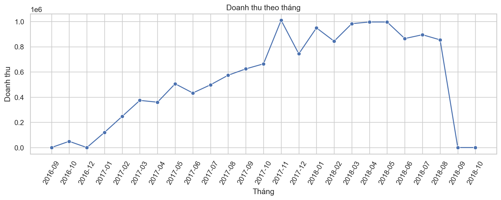

Nhận xét: ........................................................................................................................

### 3.5.2. Phân tích trạng thái đơn hàng

Phân bố trạng thái đơn hàng cho thấy phần lớn đơn hàng đã được giao thành công (`delivered`). Một số đơn hàng có trạng thái `canceled`, `unavailable`, `shipped`, `processing`, `invoiced`, `created` hoặc `approved`.

**Hình 3.3: Phân bố order status.**

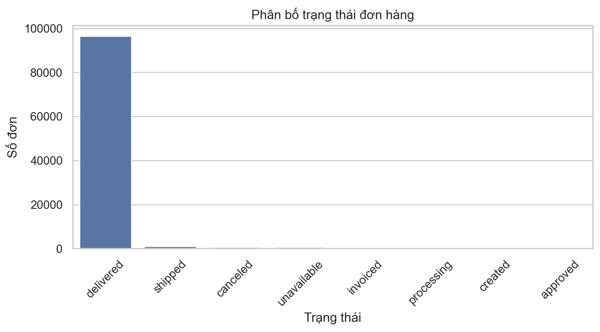

Nhận xét: ........................................................................................................................

### 3.5.3. Phân tích doanh thu theo category và khu vực

Doanh thu được phân tích theo danh mục sản phẩm và bang của khách hàng. Phần này giúp xác định các nhóm sản phẩm và khu vực đóng góp lớn vào doanh thu.

**Hình 3.4: Top category theo doanh thu.**

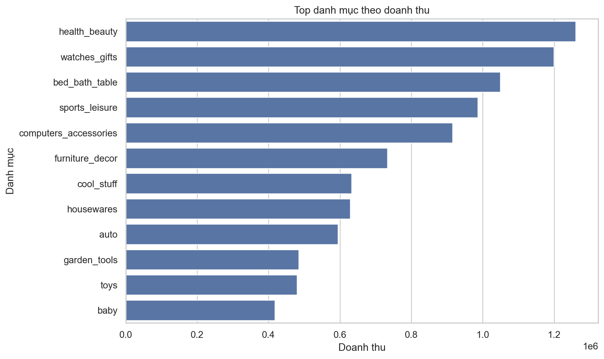

Nhận xét: ........................................................................................................................

### 3.5.4. Phân tích thanh toán

Các phương thức thanh toán gồm `credit_card`, `boleto`, `voucher`, `debit_card` và `not_defined`. Trong dữ liệu, `credit_card` là phương thức phổ biến nhất.

**Bảng/Hình 3.5: Phân bố payment type.**

Nhận xét: ........................................................................................................................

### 3.5.5. Phân tích review và giao hàng

Review score phản ánh mức độ hài lòng của khách hàng. Nhóm phân tích phân bố review score và mối liên hệ giữa giao hàng trễ với review xấu.

**Hình 3.6: Phân bố review score.**

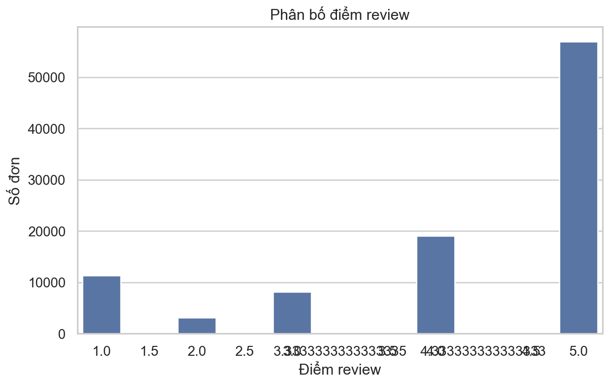

Nhận xét: ........................................................................................................................

## 3.6. Kết luận chương

Qua EDA, dữ liệu Olist cho thấy nhiều chiều phân tích phù hợp với bài toán kinh doanh: thời gian, khu vực, category, seller, payment và chất lượng giao hàng. Các kết quả EDA là cơ sở để thiết kế data warehouse, tính toán Iceberg Cube và xây dựng mô hình dự đoán review xấu.

---

# CHƯƠNG 4. TIỀN XỬ LÝ DỮ LIỆU VÀ XÂY DỰNG ĐẶC TRƯNG

## 4.1. Quy trình tiền xử lý

Pipeline tiền xử lý được triển khai trong các module `src/etl/extract.py`, `src/etl/transform.py` và script `scripts/build_processed.py`.

Quy trình gồm:

1. Đọc 9 file CSV từ thư mục `dataset/`.
2. Chuẩn hóa kiểu dữ liệu.
3. Xử lý missing values.
4. Join các bảng liên quan.
5. Tổng hợp dữ liệu về mức order-level.
6. Tạo feature phục vụ EDA, data warehouse và model.
7. Lưu dữ liệu đã xử lý vào `data/processed/`.

## 4.2. Chuẩn hóa kiểu dữ liệu

Các cột timestamp được chuyển sang kiểu datetime:

- `order_purchase_timestamp`
- `order_approved_at`
- `order_delivered_carrier_date`
- `order_delivered_customer_date`
- `order_estimated_delivery_date`
- `shipping_limit_date`
- `review_creation_date`
- `review_answer_timestamp`

Các cột số như giá, phí vận chuyển, số lần trả góp, review score và kích thước sản phẩm được chuyển sang numeric.

## 4.3. Xử lý missing values

Cách xử lý missing values:

- `product_category_name` thiếu được thay bằng `unknown`.
- Các cột kích thước/khối lượng sản phẩm thiếu được điền bằng median.
- Các timestamp giao hàng thiếu được giữ lại để phân tích trạng thái đơn hàng, nhưng khi tính feature thời gian có thể sinh giá trị missing.
- Review comment thiếu không ảnh hưởng đến bài toán chính vì model sử dụng `review_score`, không dùng NLP text.

## 4.4. Feature engineering

Các feature được tạo:

| Feature | Ý nghĩa |
|---|---|
| `delivery_days` | Số ngày từ lúc mua đến lúc giao cho khách |
| `approval_hours` | Số giờ từ lúc mua đến lúc duyệt đơn |
| `carrier_days` | Số ngày từ lúc duyệt đơn đến lúc giao cho carrier |
| `delay_days` | Số ngày giao trễ so với ngày dự kiến |
| `is_delayed` | Cờ cho biết đơn hàng có giao trễ hay không |
| `order_year_month` | Năm-tháng mua hàng |
| `order_month` | Tháng mua hàng |
| `order_day_of_week` | Thứ trong tuần |
| `item_count` | Số item trong đơn hàng |
| `total_price` | Tổng giá trị hàng hóa |
| `total_freight` | Tổng phí vận chuyển |
| `freight_ratio` | Tỷ lệ phí vận chuyển trên giá trị hàng |
| `payment_type` | Phương thức thanh toán chính |
| `max_installments` | Số kỳ trả góp lớn nhất |
| `customer_state` | Bang của khách hàng |
| `seller_state` | Bang của seller |
| `product_category_name_english` | Danh mục sản phẩm tiếng Anh |

## 4.5. Tạo target cho classification

Target `bad_review` được xây dựng từ `review_score`:

- `bad_review = 1` nếu `review_score <= 2`.
- `bad_review = 0` nếu `review_score >= 4`.
- Các review 3 sao được xem là trung tính và loại khỏi tập train/test.

## 4.6. Kết quả sau tiền xử lý

Các file output chính:

- `data/processed/order_features.csv`
- `data/processed/model_dataset.csv`
- `data/processed/fact_order_items.csv`
- `data/processed/dim_date.csv`
- `data/processed/dim_customer.csv`
- `data/processed/dim_seller.csv`
- `data/processed/dim_product.csv`
- `data/processed/dim_payment.csv`
- `data/processed/dim_order_status.csv`

## 4.7. Kết luận chương

Sau tiền xử lý, dữ liệu đã được chuẩn hóa, tổng hợp và bổ sung các feature phục vụ phân tích OLAP, Iceberg Cube và mô hình classification. Đây là đầu vào quan trọng cho các chương tiếp theo.

---

# CHƯƠNG 5. XÂY DỰNG DATA WAREHOUSE

## 5.1. Mục tiêu xây dựng data warehouse

Data warehouse được xây dựng nhằm tổ chức dữ liệu theo cấu trúc phù hợp cho phân tích đa chiều. Thay vì truy vấn trực tiếp trên nhiều file CSV rời rạc, dữ liệu được đưa vào mô hình star schema để hỗ trợ truy vấn tổng hợp theo thời gian, sản phẩm, khách hàng, seller, payment và trạng thái đơn hàng.

## 5.2. Thiết kế star schema

Star schema của đồ án gồm:

- Fact table: `fact_order_items`
- Dimension tables:
  - `dim_date`
  - `dim_customer`
  - `dim_seller`
  - `dim_product`
  - `dim_payment`
  - `dim_order_status`

**Chèn hình 5.1: Sơ đồ star schema của data warehouse.**

## 5.3. Fact table `fact_order_items`

Grain của fact table: **1 dòng = 1 item trong 1 order**.

Các khóa chính/liên kết:

- `order_id`
- `date_key`
- `customer_id`
- `seller_id`
- `product_id`
- `payment_key`
- `order_status`

Các measure:

- `price`
- `freight_value`
- `review_score`
- `delivery_days`
- `delay_days`
- `is_delayed`
- `bad_review`

## 5.4. Dimension tables

### 5.4.1. `dim_date`

Lưu thông tin ngày, tháng, quý, năm và thứ trong tuần.

### 5.4.2. `dim_customer`

Lưu thông tin khách hàng, mã khách hàng, mã khách hàng duy nhất, thành phố, bang và zip prefix.

### 5.4.3. `dim_seller`

Lưu thông tin seller, thành phố, bang và zip prefix.

### 5.4.4. `dim_product`

Lưu thông tin sản phẩm, danh mục, danh mục tiếng Anh, kích thước và khối lượng.

### 5.4.5. `dim_payment`

Lưu phương thức thanh toán, số kỳ trả góp và nhóm trả góp.

### 5.4.6. `dim_order_status`

Lưu các trạng thái đơn hàng.

## 5.5. Load dữ liệu vào database

Warehouse được load vào PostgreSQL hoặc SQL Server thông qua script:

```powershell
python scripts/load_warehouse.py
```

File `.env` dùng để cấu hình kết nối database.

Kết quả load PostgreSQL đã kiểm tra:

| Bảng | Số dòng |
|---|---:|
| `dim_date` | 634 |
| `dim_customer` | 99,441 |
| `dim_seller` | 3,095 |
| `dim_product` | 32,951 |
| `dim_payment` | 38 |
| `dim_order_status` | 8 |
| `fact_order_items` | 112,650 |

## 5.6. Query OLAP mẫu

Ví dụ truy vấn doanh thu theo tháng:

```sql
SELECT
    d.year,
    d.month,
    COUNT(DISTINCT f.order_id) AS orders,
    SUM(f.price) AS revenue
FROM fact_order_items f
JOIN dim_date d ON f.date_key = d.date_key
GROUP BY d.year, d.month
ORDER BY d.year, d.month;
```

Ví dụ truy vấn top category theo doanh thu:

```sql
SELECT
    p.product_category_name_english,
    COUNT(DISTINCT f.order_id) AS orders,
    SUM(f.price) AS revenue,
    AVG(f.review_score) AS avg_review_score
FROM fact_order_items f
JOIN dim_product p ON f.product_id = p.product_id
GROUP BY p.product_category_name_english
ORDER BY revenue DESC;
```

## 5.7. Kết luận chương

Data warehouse giúp tổ chức dữ liệu Olist theo cấu trúc phù hợp cho phân tích OLAP và dashboard. Thiết kế star schema cũng là nền tảng để tính toán Iceberg Cube ở chương tiếp theo.

---

# CHƯƠNG 6. TÍNH TOÁN ICEBERG CUBE

## 6.1. Mục tiêu

Iceberg Cube được sử dụng để phát hiện các nhóm dữ liệu tổng hợp có ý nghĩa trong thương mại điện tử. Thay vì lưu toàn bộ cube với rất nhiều tổ hợp chiều, hệ thống chỉ giữ lại các nhóm thỏa ngưỡng về số lượng đơn hàng, doanh thu hoặc tỷ lệ review xấu.

## 6.2. Thiết kế thuật toán

Input của thuật toán:

- DataFrame order-level.
- Danh sách dimensions.
- Các measure cần tổng hợp.
- Các threshold như `min_count`, `min_revenue`, `high_bad_review_rate`.

Output:

- Bảng kết quả gồm các cuboid thỏa điều kiện iceberg.

Các measure được tính:

- `count_orders`
- `sum_revenue`
- `avg_review_score`
- `avg_delivery_days`
- `delay_rate`
- `bad_review_rate`

## 6.3. Các chủ đề cube

Nhóm tính toán các cube theo 4 chủ đề:

1. Sales by time, category and customer state.
2. Delivery quality by seller state, category and delay flag.
3. Payment satisfaction by payment type, installments and review group.
4. Geographic trade lanes by customer state, seller state and review group.

## 6.4. Kết quả Iceberg Cube

Kết quả được lưu trong:

- `data/warehouse/iceberg_cube_sales_by_time_category_state.csv`
- `data/warehouse/iceberg_cube_delivery_quality.csv`
- `data/warehouse/iceberg_cube_payment_satisfaction.csv`
- `data/warehouse/iceberg_cube_geo_trade_lanes.csv`
- `data/warehouse/iceberg_cube_results.csv`

Kết quả đã chạy:

| Cube | Số dòng |
|---|---:|
| Sales by time/category/state | 841 |
| Delivery quality | 432 |
| Payment satisfaction | 77 |
| Geo trade lanes | 389 |

**Hình 6.1: Số pattern được giữ lại theo từng Iceberg Cube.**

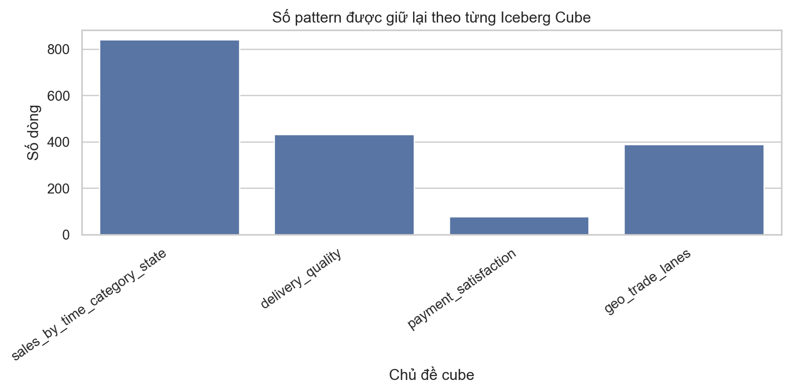

**Bảng 6.1: Top pattern theo doanh thu.**

**Bảng 6.2: Top pattern theo bad review rate.**

**Bảng 6.3: Top pattern theo delay rate.**

**Hình 6.2: Top pattern có tỷ lệ review xấu cao.**

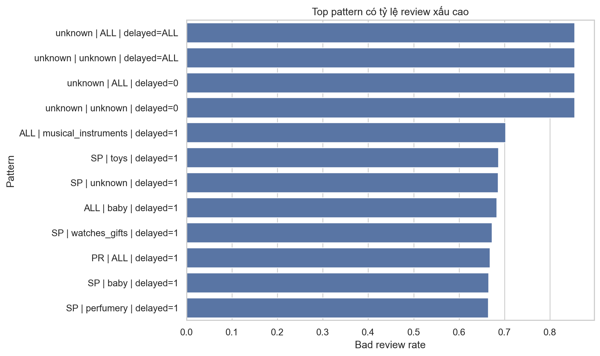

## 6.5. Nhận xét

Iceberg Cube giúp rút gọn không gian phân tích và tập trung vào các nhóm dữ liệu quan trọng. Các pattern có doanh thu cao giúp xác định phân khúc kinh doanh nổi bật, trong khi các pattern có delay rate hoặc bad review rate cao giúp phát hiện vấn đề vận hành cần cải thiện.

## 6.6. Kết luận chương

Việc áp dụng Iceberg Cube đã đáp ứng yêu cầu phân tích OLAP nâng cao của đồ án và tạo thêm góc nhìn có giá trị cho dashboard/ứng dụng.

---

# CHƯƠNG 7. MÔ HÌNH CLASSIFICATION DỰ ĐOÁN REVIEW XẤU

## 7.1. Phát biểu bài toán

Bài toán classification trong đồ án là dự đoán một đơn hàng có khả năng nhận review xấu hay không. Review xấu được định nghĩa là review có `review_score <= 2`.

Input của mô hình gồm các đặc trưng liên quan đến:

- giá trị đơn hàng;
- phí vận chuyển;
- phương thức thanh toán;
- số item;
- category;
- bang của khách hàng;
- bang của seller;
- thời gian giao hàng;
- số ngày trễ;
- thời điểm mua hàng.

Output của mô hình là nhãn `bad_review`.

## 7.2. Chuẩn bị dữ liệu train/test

Dataset train được tạo từ `model_dataset.csv`. Các review 3 sao được loại bỏ để tránh nhãn trung tính. Dữ liệu được chia train/test theo tỷ lệ 80/20 và có stratify theo target.

Tỷ lệ lớp positive:

- `bad_review = 1`: khoảng 15.97%

## 7.3. Mô hình baseline

Mô hình baseline là Logistic Regression. Mô hình này đơn giản, dễ cài đặt và thường được dùng làm mốc so sánh ban đầu cho các bài toán classification.

Pipeline preprocessing:

- Numeric features: điền missing bằng median và chuẩn hóa.
- Categorical features: điền missing bằng most frequent và one-hot encoding.

## 7.4. Mô hình tối ưu

Nhóm sử dụng Random Forest làm mô hình chính. Random Forest có khả năng học quan hệ phi tuyến, xử lý tốt dữ liệu hỗn hợp và giảm overfitting nhờ cơ chế ensemble.

Ngoài ra, code cũng hỗ trợ HistGradientBoosting để thử nghiệm nâng cao.

## 7.5. Kết quả đánh giá

Nhóm đã chạy đủ ba mô hình classification để so sánh: Logistic Regression, Random Forest và HistGradientBoosting. Kết quả được lưu tại `docs/report/model_comparison.csv`.

**Bảng 7.1: So sánh kết quả các mô hình classification.**

| Mô hình | Accuracy | Precision | Recall | F1 | ROC-AUC | Avg Precision |
|---|---:|---:|---:|---:|---:|---:|
| Random Forest | 0.8822 | 0.6836 | 0.4889 | 0.5701 | 0.7956 | 0.5890 |
| HistGradientBoosting | 0.8901 | 0.8005 | 0.4152 | 0.5468 | 0.7998 | 0.5991 |
| Logistic Regression | 0.7976 | 0.3962 | 0.5104 | 0.4461 | 0.7397 | 0.4697 |

Random Forest được chọn làm mô hình chính vì đạt F1 cao nhất. HistGradientBoosting có accuracy, precision và ROC-AUC cao hơn, nhưng recall thấp hơn nên F1 tổng thể thấp hơn Random Forest trong mục tiêu phát hiện review xấu.

**Hình 7.1: Bảng so sánh kết quả các mô hình.**

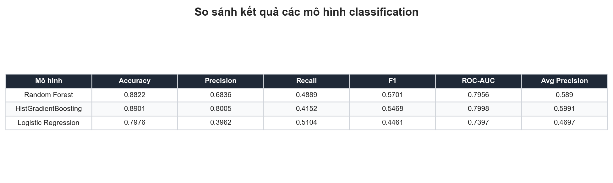

**Hình 7.2: Biểu đồ so sánh các chỉ số chính.**

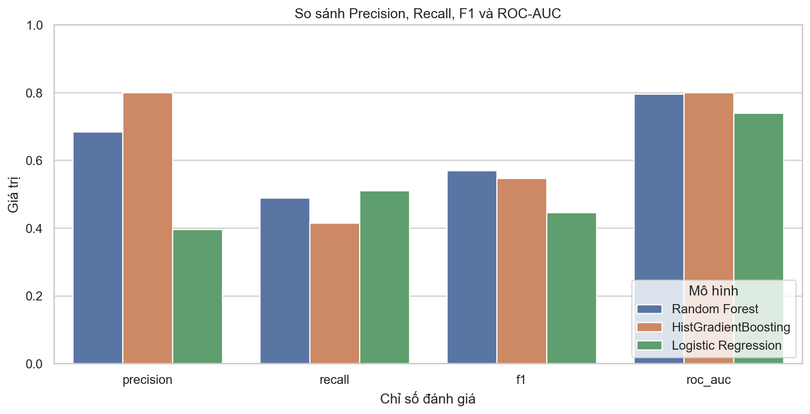

Kết quả mô hình Random Forest:

| Metric | Giá trị |
|---|---:|
| Accuracy | 0.8822 |
| Precision lớp bad review | 0.6836 |
| Recall lớp bad review | 0.4889 |
| F1 lớp bad review | 0.5701 |
| ROC-AUC | 0.7956 |
| Average Precision | 0.5890 |

Confusion matrix:

|  | Predicted 0 | Predicted 1 |
|---|---:|---:|
| Actual 0 | 14,552 | 654 |
| Actual 1 | 1,477 | 1,413 |

**Hình 7.3: Confusion Matrix.**

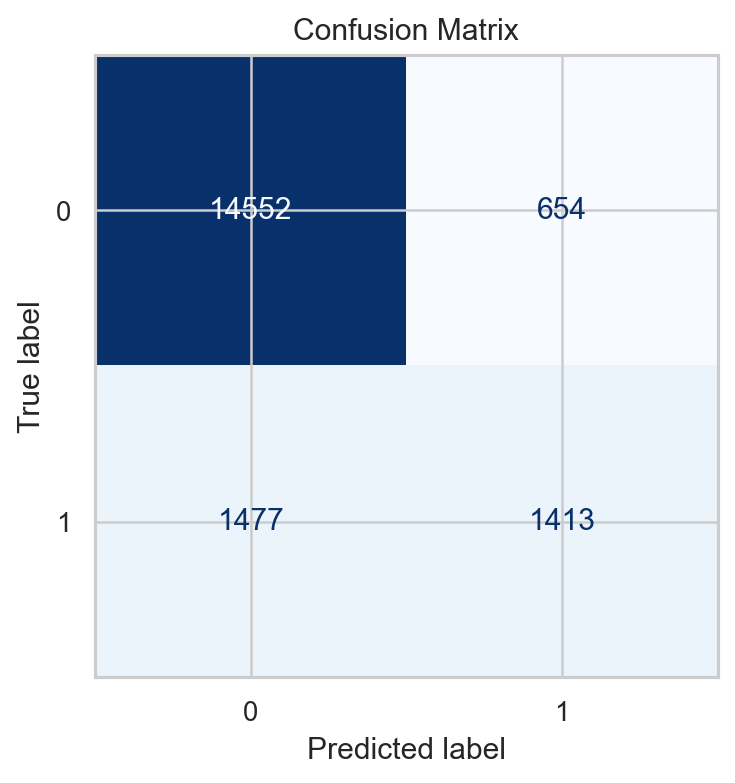

**Hình 7.4: ROC Curve.**

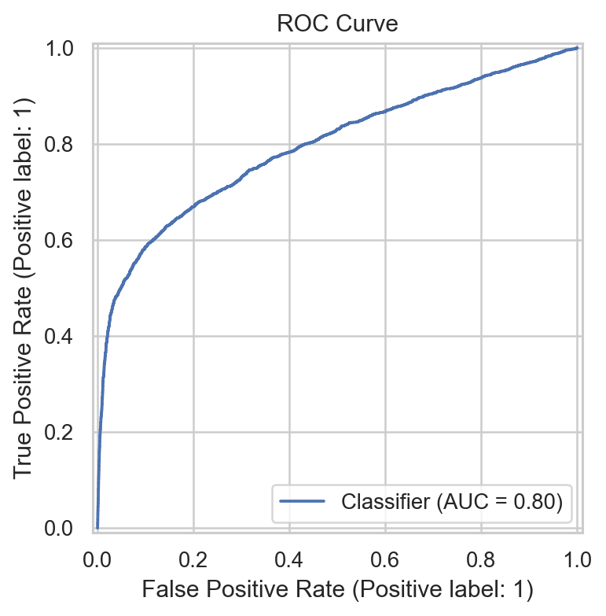

**Hình 7.5: Precision-Recall Curve.**

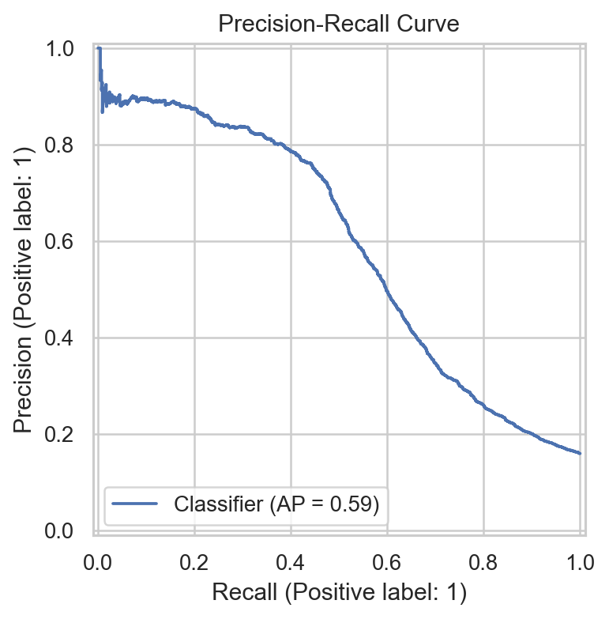

**Hình 7.6: Feature Importance.**

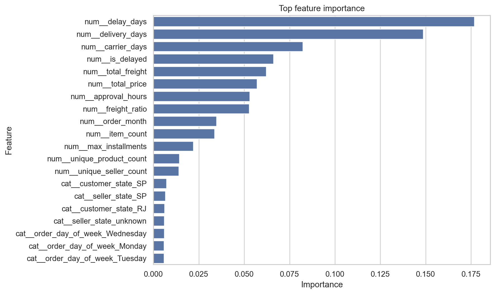

## 7.6. Nhận xét

Mô hình đạt accuracy cao và ROC-AUC ở mức khá. Precision của lớp review xấu tương đối tốt, nghĩa là khi mô hình dự đoán một đơn hàng có nguy cơ review xấu thì dự đoán có độ tin cậy nhất định. Tuy nhiên, recall của lớp review xấu còn có thể cải thiện, cho thấy mô hình vẫn bỏ sót một số đơn hàng có review xấu.

Nguyên nhân có thể đến từ mất cân bằng lớp, thiếu các đặc trưng hành vi sâu hơn hoặc chưa khai thác review text. Trong tương lai, có thể cải thiện bằng cách thử thêm mô hình boosting, tuning hyperparameter, resampling hoặc kết hợp NLP từ comment review.

## 7.7. Kết luận chương

Mô hình classification đã đáp ứng yêu cầu khai phá dữ liệu của đồ án và có thể tích hợp vào API/web app để dự đoán nguy cơ review xấu cho đơn hàng mới.

---

# CHƯƠNG 8. TRIỂN KHAI ỨNG DỤNG

## 8.1. Kiến trúc hệ thống

Kiến trúc tổng quát:

```text
CSV Dataset -> ETL/Preprocessing -> Data Warehouse -> Iceberg Cube/Model -> API -> Streamlit App
```

**Chèn hình 8.1: Sơ đồ kiến trúc hệ thống.**

## 8.2. FastAPI

FastAPI được dùng để đóng gói các chức năng backend.

Các endpoint:

| Endpoint | Chức năng |
|---|---|
| `/health` | Kiểm tra trạng thái API |
| `/summary` | Trả về thông tin tổng quan dataset |
| `/metrics` | Trả về metrics của model |
| `/cube` | Trả về kết quả Iceberg Cube |
| `/predict` | Dự đoán nguy cơ review xấu |

## 8.3. Streamlit dashboard

Ứng dụng Streamlit gồm các tab:

- Overview: tổng quan số đơn, doanh thu, review trung bình, delay rate và bad review rate.
- EDA: biểu đồ doanh thu, trạng thái đơn hàng, payment type, category và state.
- Iceberg Cube: bảng các pattern được giữ lại sau khi áp dụng threshold.
- Prediction: form nhập thông tin đơn hàng để dự đoán nguy cơ review xấu.

**Chèn hình 8.2: Giao diện overview dashboard.**

**Chèn hình 8.3: Giao diện Iceberg Cube.**

**Chèn hình 8.4: Giao diện prediction.**

## 8.4. Quy trình chạy demo

Các lệnh chạy:

```powershell
python scripts/build_processed.py
python scripts/load_warehouse.py
python scripts/run_iceberg_cube.py
python scripts/train_bad_review_model.py
uvicorn api.main:app --reload --host 0.0.0.0 --port 8000
streamlit run app/Home.py
```

## 8.5. Kết luận chương

Ứng dụng web và API giúp trình diễn kết quả của toàn bộ pipeline, từ EDA, data warehouse, Iceberg Cube đến mô hình dự đoán. Đây là phần kết nối giữa kết quả phân tích và trải nghiệm người dùng cuối.

---

# CHƯƠNG 9. KẾT LUẬN VÀ HƯỚNG PHÁT TRIỂN

## 9.1. Kết quả đạt được

Đồ án đã đạt được các kết quả:

- Mô tả đầy đủ bộ dữ liệu Olist.
- Thực hiện EDA trên dữ liệu thương mại điện tử.
- Xây dựng pipeline tiền xử lý và feature engineering.
- Thiết kế và load data warehouse vào PostgreSQL/SQL Server.
- Cài đặt Iceberg Cube và sinh kết quả phân tích theo nhiều chủ đề.
- Huấn luyện mô hình classification dự đoán review xấu.
- Triển khai FastAPI và Streamlit dashboard.
- Quản lý công việc nhóm bằng GitHub Project.

## 9.2. Hạn chế

Một số hạn chế:

- Chưa phân tích sâu nội dung review comment bằng NLP.
- Dữ liệu chỉ bao phủ giai đoạn 2016-2018.
- Mô hình còn có thể cải thiện recall của lớp bad review.
- Dashboard chưa có bản đồ địa lý chi tiết.
- Chưa đóng gói hệ thống bằng Docker hoặc triển khai cloud.

## 9.3. Hướng phát triển

Các hướng phát triển:

- Áp dụng NLP để phân tích sentiment từ review comment.
- Bổ sung clustering khách hàng hoặc seller.
- Tối ưu mô hình bằng hyperparameter tuning.
- Thêm dashboard bản đồ theo geolocation.
- Đóng gói bằng Docker.
- Tự động hóa pipeline bằng scheduler.
- Triển khai lên cloud để demo trực tuyến.

## 9.4. Kết luận chung

Dự án đã xây dựng được một hệ thống phân tích dữ liệu thương mại điện tử tương đối hoàn chỉnh, bao gồm các bước từ xử lý dữ liệu, xây dựng warehouse, phân tích OLAP bằng Iceberg Cube, huấn luyện mô hình classification đến triển khai ứng dụng. Kết quả cho thấy bộ dữ liệu Olist phù hợp để minh họa các kỹ thuật khai phá dữ liệu và data warehouse trong bối cảnh kinh doanh thực tế.

---

# TÀI LIỆU THAM KHẢO

1. Olist Brazilian E-Commerce Public Dataset, Kaggle.
2. pandas documentation.
3. scikit-learn documentation.
4. PostgreSQL documentation.
5. SQL Server documentation.
6. FastAPI documentation.
7. Streamlit documentation.
8. Tài liệu về data warehouse, OLAP và data cube.

---

# PHỤ LỤC

## Phụ lục A. Cấu trúc thư mục dự án

```text
.
├── api/
├── app/
├── dataset/
├── data/
├── docs/
├── models/
├── notebooks/
├── scripts/
└── src/
```

## Phụ lục B. Các script chính

| Script | Chức năng |
|---|---|
| `scripts/build_processed.py` | Sinh dữ liệu processed |
| `scripts/load_warehouse.py` | Load star schema vào database |
| `scripts/run_iceberg_cube.py` | Tính Iceberg Cube |
| `scripts/train_bad_review_model.py` | Train model classification |

## Phụ lục C. Link repository

GitHub repository: https://github.com/Tommyhuy1705/Olist_E-Commerce_Analytics
